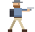

# 🧟 街区死守 Block Siege

2D 像素风横板僵尸肉鸽塔防射击游戏（Godot 4）。

白天买装备备战，夜晚僵尸从街道两侧涌来。撑过 10 天即胜利。
每晚结束后获得金币 + 三选一肉鸽强化，每局构筑不同。



## 目录结构

| 目录 | 说明 |
|---|---|
| `godot/` | **主版本**：Godot 4.3+ 工程（像素风） |
| `web/` | 原型版本：HTML5 Canvas（第一阶段 MVP，保留作参考） |
| `tools/` | 开发工具：像素占位美术生成器等 |

## 运行 Godot 版（主版本）

1. 下载 [Godot 4.3+](https://godotengine.org/download)（标准版即可，不需要 .NET 版）
2. 打开 Godot → Import → 选择本仓库的 `godot/project.godot`
3. 按 F5 运行

命令行方式：

```
godot --path godot
```

### 无头测试（不开窗口验证核心逻辑）

```
godot --headless --path godot --script res://test/headless_test.gd
```

模拟真实按键跑完 白天→夜晚战斗→结算 全流程，21 项断言。

## 运行 Web 原型版

```
cd web
node server.js     # 然后打开 http://localhost:8000
node test/smoke.mjs  # 逻辑冒烟测试（35 项）
```

## 操作

| 按键 | 功能 |
|---|---|
| WASD / 方向键 | 上下左右移动（街道带内） |
| 鼠标 | 瞄准 + 左键射击 |
| R | 换弹 |
| 空格 / F | 踹开近身僵尸（有冷却） |
| Q / 数字键 | 切换武器 |
| Esc | 暂停 |

### 武器槽

- `1`：主武器槽 1
- `2`：主武器槽 2
- `3`：副武器槽
- `4`：近战武器槽
- `Q`：在已有武器槽之间循环切换
- `空格 / F`：无论当前持枪为何，都可快速使用近战武器
- 选择近战槽后，鼠标左键也会发动近战攻击

当前武器包括 M1911、UZI、Kar98k、雷明顿 870、AK-47、M4A1、
M249、战术匕首和开山刀。角色最多携带两把主武器、一把副武器和
一把近战武器；主武器槽满后，必须继续使用现有配置。

## Godot 工程结构

```
godot/
  project.godot            工程配置（1280x720，像素画风 nearest 过滤）
  scenes/main.tscn         唯一场景（其余全部代码构建）
  assets/sprites/          像素占位美术（tools/gen_sprites.mjs 生成）
  src/
    main.gd                主控状态机（menu→day→night→reward 循环）
    config.gd              全局配置
    street_background.gd   像素街景（程序化：天空/山/草场/马路）
    data/                  ★ 数据驱动层：加内容改这里，不动逻辑
      weapons.gd           武器表
      enemies.gd           僵尸表
      waves.gd             天数/尸潮强度曲线
      perks.gd             肉鸽奖励表
      shop_data.gd         商店条目
    entities/
      player.gd            玩家（移动/武器背包/换弹/踹击/mods 加成）
      zombie.gd            僵尸（追踪/攻击/击退/硬直）
      bullet.gd            子弹（穿透/射程）
    fx/fx_layer.gd         粒子特效 + 准星
    ui/
      hud.gd               战斗 HUD
      screens.gd           菜单/商店/奖励/结算界面
  test/headless_test.gd    无头端到端测试
```

## 扩展方式

- **加武器**：`src/data/weapons.gd` 加一条 + `shop_data.gd` 加购买项
- **加僵尸**：`src/data/enemies.gd` 加一条 + `waves.gd` 的 pool 里按天解锁
- **加肉鸽奖励**：`src/data/perks.gd` 加一条（声明式 effects）
- **调难度**：`src/data/waves.gd` 的曲线函数
- **换美术**：替换 `assets/sprites/` 的 PNG（角色 24x32，游戏内 3 倍缩放）

## 路线图

- [x] 阶段①：核心循环骨架（移动/射击/换弹/踹击/尸潮/商店/肉鸽/10天）
- [x] 迁移 Godot 4 + 像素风占位美术
- [ ] 阶段②：武器扩展（98k、F2000、UZI、轻机枪、马格南…穿透/爆炸机制）
- [ ] 阶段③：塔防建造槽位（路障/地雷/机枪塔/电网/喷火器）
- [ ] 阶段④：僵尸种类（快速/坦克/自爆/远程）+ 波次设计
- [ ] 阶段⑤：肉鸽扩充 + 存档
- [ ] 阶段⑥：手感表现（音效/震屏/更好的美术）
